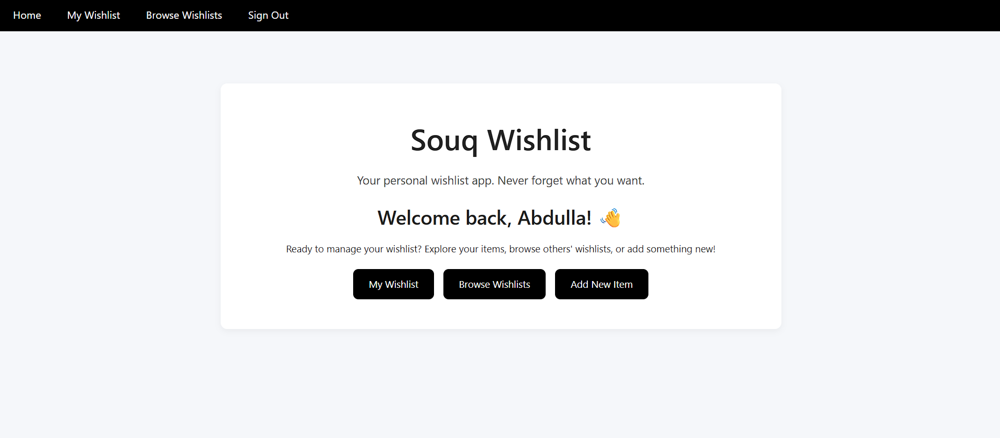

#  Souq Wishlist

## 🛒 Description
Souq Wishlist is a full-stack web application built with Node.js, Express, MongoDB, and EJS.
It allows users to create and manage personal wishlists, browse items shared by others, and view detailed information about each item.

## Website link
https://souq-wishlist-d913ef3a32c5.herokuapp.com/

## 🎯 Features
User Authentication: Sign up, sign in, and sign out securely.

Personal Wishlists: Create, view, update, and delete your own items.

Community Browse: View wishlists from other users.

Consistent UI: Unified navbar, buttons, and card components.

## 🛠️ Technologies Used
Backend: Node.js, Express.js, MongoDB, Mongoose

Frontend: EJS Templates, CSS, W3/Bootstrap styling

Authentication: Session-based with middleware protection

